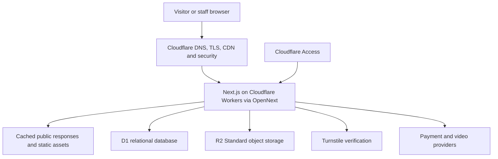
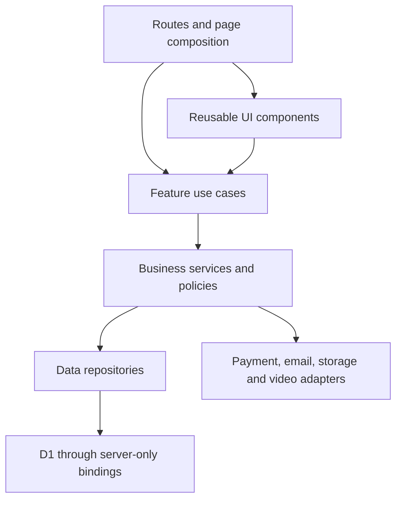
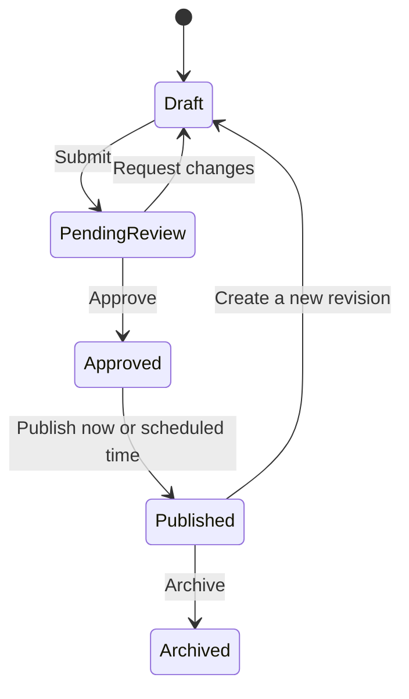
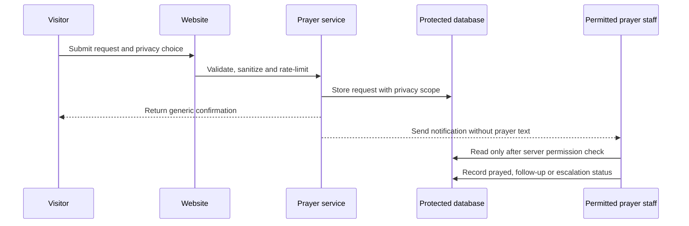
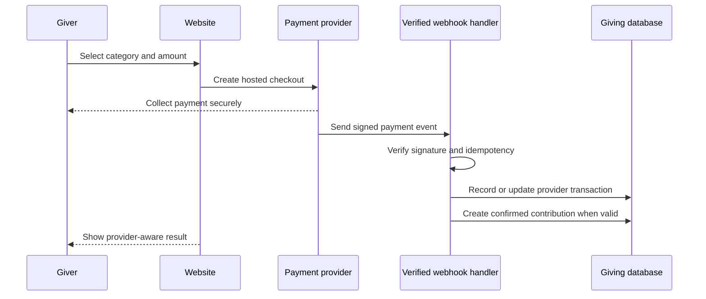
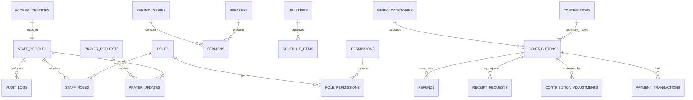

# Lifechangers Ministry Incorporated Website Architecture

## Status

Cloudflare-first architecture approved on 2026-09-10. Staff authentication and
account administration now use Cloudflare Access and D1. Existing Supabase
helpers and PostgreSQL migrations are retained only as an inactive rollback
prototype until final migration cleanup is explicitly approved. They must not be
deployed as the production backend. Items marked **To confirm** are not approved
requirements yet.

The detailed database design and role matrix are documented in `DATABASE_SCHEMA.md` and `PERMISSION_MATRIX.md`.

## Architecture Goals

- Deliver a fast, accessible, search-friendly public church website.
- Provide a secure administration area with individual staff accounts.
- Enforce authorization at the trusted server boundary and reinforce it with database constraints, not only in the interface.
- Protect prayer requests, donor information, and financial records.
- Keep content, business rules, database access, and external integrations separated.
- Start on free service tiers without requiring a rewrite when paid production plans are activated.
- Keep the system understandable and maintainable by a small development team.

## Confirmed Non-Goals for the Initial Release

- Public member accounts
- Recurring online giving
- A complete accounting, payroll, or expense-management system
- Hosting or streaming sermon videos directly from the website
- A `Plan a Visit` workflow
- Automatic synchronization of all Facebook posts

## System Context

```mermaid
flowchart LR
    Visitor["Public visitor"] --> App["Next.js website"]
    Staff --> Access["Cloudflare Access"]
    Access --> App
    App --> Database["Cloudflare D1"]
    App --> Storage["Cloudflare R2"]
    App --> Bot["Cloudflare Turnstile"]
    App --> Video["Facebook / YouTube embeds"]
    App --> Payment["Payment gateway - to confirm"]
    Payment --> Webhook["Verified payment webhook"]
    Webhook --> Database
```

## Deployment Architecture



### Free-to-Paid Path

| Layer               | Initial plan                                         | Upgrade path                                         | Application change expected                                            |
| ------------------- | ---------------------------------------------------- | ---------------------------------------------------- | ---------------------------------------------------------------------- |
| Application hosting | Cloudflare Workers Free                              | Workers Paid after approval                          | None beyond billing and limit configuration                            |
| Database            | Cloudflare D1 Free                                   | Paid D1 capacity or repository-backed migration      | None for paid D1; contained repository change for another SQL database |
| Staff identity      | Cloudflare Access Free                               | Access paid plan if staff exceed the free seat limit | Policy/configuration change                                            |
| File storage        | R2 Standard within an application-enforced allowance | Paid R2 usage after approval                         | None beyond quota/configuration changes                                |
| Transactional email | Dashboard-only notifications initially               | Approved email provider                              | Integration adapter implementation/configuration                       |
| Video               | Facebook/YouTube embeds                              | Same providers or approved alternative               | No database redesign                                                   |
| Payment             | Provider test mode, then live account                | Volume/custom pricing                                | No ledger redesign; provider fees still apply                          |

## Trust Boundaries

1. **Public boundary**
   - Visitors may read published content only.
   - Public forms accept untrusted input and must be validated, sanitized, rate-limited, and protected from spam.

2. **Authenticated staff boundary**
   - Staff must sign in using individual accounts.
   - Cloudflare Access authentication with an exact-email allowlist is required for administration. Higher-assurance identity-provider MFA remains a security recommendation for sensitive roles.
   - A signed-in user has no permission unless an active role grants it.

3. **Sensitive ministry boundary**
   - Prayer content is restricted by privacy selection and staff permission.
   - Prayer text must not appear in routine logs, analytics, or notification subject lines.

4. **Financial boundary**
   - Donor and giving details use dedicated finance permissions.
   - The application never stores card numbers, CVVs, wallet credentials, or bank login details.
   - Provider-hosted checkout is preferred.

5. **Privileged service boundary**
   - Cloudflare deployment credentials are server/deployment-only.
   - Browser code receives only public configuration values intended for client use.
   - Webhooks and privileged administrative operations run in protected Worker or server endpoints.

## Application Layers



### Layer Responsibilities

- **Routes:** navigation, layouts, page metadata, loading states, and error boundaries.
- **UI components:** accessible visual elements without database or payment logic.
- **Features:** forms, tables, workflow screens, and feature-specific orchestration.
- **Services:** approval rules, giving corrections, privacy decisions, and other business logic.
- **Repositories:** typed database reads and writes. UI components do not query tables directly.
- **Integrations:** provider-specific code behind stable application interfaces.

## Proposed Source Structure

```text
src/
  app/
    (public)/
      page.tsx
      about/
      activities/
      announcements/
      contact/
      give/
      ministries/
      prayer/
      sermons/
    admin/
      layout.tsx
      dashboard/
      activities/
      announcements/
      audit/
      bulletins/
      giving/
      ministries/
      prayer/
      sermons/
      settings/
      staff/
    api/
      health/
      webhooks/
  components/
    layout/
    ui/
  features/
    activities/
    announcements/
    audit/
    authentication/
    bulletins/
    contact/
    giving/
    ministries/
    prayer/
    publishing/
    sermons/
    staff/
  lib/
    config/
    errors/
    validation/
  server/
    cloudflare/
    integrations/
    services/
    repositories/
migrations/
  d1/
supabase/ # preserved legacy prototype until migration exit criteria pass
tests/
  e2e/
  integration/
  unit/
```

Feature directories should expose a small public interface. Internal components, schemas, and helpers remain private to the feature unless genuinely reusable.

## Functional Modules

| Module         | Responsibility                                                       | Sensitive data             |
| -------------- | -------------------------------------------------------------------- | -------------------------- |
| Public content | Home, About, ministry information, reusable page sections            | No                         |
| Sermons        | Series, speakers, sermon metadata and external video links           | No                         |
| Schedule       | Daily activities, services, Cell Groups, meetings and special events | Location privacy may apply |
| Announcements  | Time-bound public updates                                            | No                         |
| Bulletins      | Bulletin metadata, files and publication                             | Usually no                 |
| Publishing     | Draft, review, approval, scheduling, publishing and archiving        | Staff identity             |
| Prayer         | Prayer submissions, privacy, assignment, follow-up and status        | Yes                        |
| Engagement     | Contact and ministry-interest submissions                            | Yes                        |
| Giving         | Online and offline contributions, adjustments, refunds and reports   | Yes                        |
| Staff access   | Profiles, roles, permissions, identity state and account status      | Yes                        |
| Audit          | Security, publishing and finance activity history                    | Yes                        |
| Settings       | Church information and integration configuration references          | Some                       |

## Identity and Authorization

### Identity Model

- Cloudflare Access authenticates approved staff email identities before requests reach protected administration routes.
- Trusted server code validates the Access token and maps its stable identity to `staff_profiles`.
- `staff_profiles` stores church-specific profile information and account status; an Access-authenticated identity has no application permission until this profile is active.
- `roles` stores named roles.
- `permissions` stores granular capabilities.
- `staff_roles` assigns one or more active roles to a staff profile.
- `role_permissions` maps roles to capabilities.

Role names are convenient groupings. Authorization decisions use permissions so the system does not become locked to eleven hard-coded role names.

### Authentication and Staff Onboarding

1. Public self-registration remains disabled.
2. A Cloudflare Access policy allowlists each approved staff email; broad email-domain or `Everyone` rules are prohibited.
3. Staff authenticate using Cloudflare Access email one-time PIN initially. A church-controlled identity provider may be added later without changing the application role model.
4. The first System Administrator mapping is created through a documented, single-use bootstrap procedure.
5. An authorized administrator records a pending invitation, then manually adds
   the same exact email to the Access allowlist. First sign-in creates the D1
   profile and initial role in one transaction.
6. Every protected request validates the Access token and active staff context on the server.
7. Invitations, role changes, Core Leader elevation, revocation, and suspension are permission checked and audited in D1 transactions.
8. The final active System Administrator cannot be suspended or lose their final administrator role.

Cloudflare account credentials and deployment tokens remain server/deployment
secrets. D1 and R2 are accessed only through Worker bindings and are never
exposed directly to browser components.

The origin validates the `Cf-Access-Jwt-Assertion` header using Cloudflare's
rotating remote JWK set. Validation requires RS256, the configured issuer and
application audience, expiry and issuance timestamps, an application-token type,
and verified subject/email claims. Protected API responses are never publicly
cached.

### Initial Role Intent

| Role                 | Primary scope                                                                                                                                    |
| -------------------- | ------------------------------------------------------------------------------------------------------------------------------------------------ |
| System Administrator | Accounts, roles, security, settings, integrations and audit access                                                                               |
| Senior Pastor        | Ministry oversight, content approval, permitted prayer access and giving summaries                                                               |
| Associate Pastor     | Delegated ministry oversight, approval, permitted prayer access and giving summaries                                                             |
| Leader               | Associate-Pastor-equivalent operational access, including ministry oversight, approval, permitted prayer access and giving summaries             |
| Core Leader          | System-Administrator-assigned elevation for selected trusted Leaders; mirrors Senior Pastor permissions, including sensitive financial approvals |
| Multimedia Head      | Multimedia content management plus approval and publishing within the Multimedia scope                                                           |
| Multimedia Team      | Sermons, media, activities and assigned announcements                                                                                            |
| Bulletin Head        | Bulletin content management plus approval and publishing within the Bulletin scope                                                               |
| Bulletin Team        | Bulletins, announcements and assigned activities                                                                                                 |
| Treasurer            | Detailed giving, reconciliation, receipts, adjustments, refunds and reports                                                                      |
| Prayer Warriors      | Permitted prayer requests, prayer updates and pastoral escalation                                                                                |

### Separation of Duties

- System Administrators do not automatically receive donor or prayer-content access.
- Content authors do not approve their own changes unless they hold the explicit `content.self_approve` permission.
- Multimedia and Bulletin Heads receive scoped self-approval permission for their assigned content types. Self-approval is clearly marked and audited.
- Approval and publishing require both the generic workflow permission and management permission for the content type. This keeps Multimedia and Bulletin Heads inside their assigned scopes.
- Verified online transaction amounts cannot be edited manually.
- Financial adjustments and refunds require a separate approval permission.
- Exporting prayer or finance data is a distinct permission and is audited.

### Database Enforcement

- D1 is never exposed directly to browsers; every query runs in trusted server code.
- Public repositories return only published, non-sensitive fields.
- Protected services check the active profile and exact permission before repository access.
- Sensitive finance, prayer, role, and publishing operations use explicit authorization guards and auditable transactions.
- Permission tests cover both allowed and denied paths for every protected operation.
- SQL uses bound parameters. User-controlled identifiers, filters, sort values, and file names are allowlisted or normalized before use.

## Publishing Workflow



Rules:

- Multimedia and Bulletin staff prepare drafts within their assigned content areas.
- Multimedia and Bulletin Heads approve and publish content within their assigned content areas, including their own work through scoped self-approval permission.
- Senior Pastors, Core Leaders, Associate Pastors and Leaders approve content when granted the approval permission.
- Publishing and scheduling are separate permissions if the church later requires them.
- Rejection/request-change actions require a reason.
- Published content is not directly overwritten; changes create a new revision or an auditable update.
- Publishing invalidates the relevant public cache so approved updates become visible.

Senior Pastors, Core Leaders, Associate Pastors and Leaders may approve qualifying content created by another account. Multimedia and Bulletin Heads may also self-approve inside their assigned scopes, and the action is explicitly recorded. Emergency publishing remains proposed for the Senior Pastor and Core Leaders.

## Church Schedule Architecture

One `schedule_items` domain supports:

- Daily activities
- Weekly services
- Family Cell Groups
- Discipleship meetings
- Prayer meetings
- Ministry meetings
- Campus or barangay outreach
- Special events

Schedule items support one-time and recurring patterns. Exceptions handle cancelled or rescheduled occurrences without rewriting the full series.

Location visibility options should include:

- Exact public address
- General area only
- Contact the church for the location
- Staff-only location

This protects private Cell Group homes while keeping the public schedule useful.

## Prayer Request Architecture

### Submission Flow



### Privacy Scopes

- `prayer_team`: Prayer Warriors plus permitted pastors.
- `pastoral_only`: Senior and Associate Pastors with the required permission.
- Anonymous requests omit or restrict requester identity while retaining the prayer text.

Recommended data lifecycle:

- Open
- In prayer
- Follow-up requested
- Escalated
- Closed
- Retention review

**To confirm:** whether `pastoral_only` will be offered publicly and how long closed requests should be retained.

## Giving Architecture

The website records contributions and reconciliation information. It is not the church's full accounting ledger.

### Core Principles

- Use integer minor units for money values; do not store floating-point currency amounts.
- Store currency explicitly, initially `PHP`.
- Preserve the original contribution record.
- Corrections create adjustments rather than replacing history.
- Monthly and yearly totals come from database views or queries, not editable dashboard fields.
- Do not store full payment credentials.

### Logical Records

- `giving_categories`: approved funds and categories.
- `contributors`: optional giver identity, separated from transaction data.
- `contributions`: canonical online or offline giving record.
- `payment_transactions`: provider reference, status, fees and settlement metadata.
- `offline_contribution_details`: cash/bank/check reference and verification state.
- `contribution_adjustments`: auditable corrections.
- `refunds`: requested, approved, submitted and completed refund state.
- `receipt_requests`: receipt workflow without storing unnecessary identity fields.
- `webhook_events`: idempotency and processing status for provider callbacks.

### Online Giving Flow



The browser redirect is not proof of payment. Only a verified provider event or server-side provider confirmation updates the authoritative payment status.

### Offline Giving Flow

1. Treasurer creates a pending offline entry.
2. A permitted verifier checks the supporting information.
3. Verification confirms the contribution.
4. Any later correction creates an adjustment.
5. Every step records actor, timestamp, reason and before/after context in the audit system.

**To confirm:** giving categories, receipt fields, verifier role, refund approver and correction thresholds.

## High-Level Data Domains

This is a logical model, not the final migration schema.



## Storage Architecture

Proposed R2 prefixes/buckets:

| Bucket                | Access                             | Intended files                           |
| --------------------- | ---------------------------------- | ---------------------------------------- |
| `public-content`      | Public read, authorized write      | Website images and approved public media |
| `bulletins`           | Public read only after publication | Approved bulletin files                  |
| `finance-evidence`    | Treasurer/finance permission only  | Approved offline-giving evidence         |
| `private-submissions` | Restricted staff only              | Future approved private attachments      |

Prayer-request attachments are excluded initially unless the church explicitly requires them. This avoids introducing a high-risk file-upload feature without a confirmed need.

All uploads require file-size limits, permitted MIME types, generated storage names, authorization checks, and malware-risk handling appropriate to the file type.

## API and Server Operations

- Use Next.js Server Actions only for feature-local mutations where their behavior is clear and testable.
- Use Route Handlers for webhooks, health checks, downloads and integration endpoints.
- Use Cloudflare Workers or protected Next.js Route Handlers for integrations that must run independently from page rendering.
- Validate every input with shared schemas at the trusted server boundary.
- Return structured, non-sensitive errors with stable error codes.
- Apply idempotency to payment webhooks, notification jobs and retryable operations.
- Paginate large admin tables and exports.

No database service credential may be used in browser-delivered code.

## Caching and Performance

- Public published content is cached at the application/CDN layer.
- Publishing invalidates only affected pages and lists.
- Admin, prayer and giving responses use private/no-store behavior.
- Images use responsive dimensions and modern formats.
- Sermon video remains externally hosted and lazy-loaded.
- Public database queries select only required fields.
- Frequently filtered columns receive indexes after query patterns are confirmed.

## Error Handling and Observability

- Public users receive friendly error states and retry guidance.
- Staff receive actionable messages without raw database or provider errors.
- Server logs use request/correlation identifiers.
- Logs must exclude prayer text, credentials, payment secrets and unnecessary personal data.
- Security-relevant events and business audit events are stored separately from technical logs.
- Health checks verify the application without exposing database details.

## Security Controls

- Staff identity is protected by an exact-email Cloudflare Access allowlist. Higher-assurance identity-provider MFA remains recommended for System Administrators and sensitive roles when an approved no-cost option is available.
- Short, secure administration sessions with clear logout and expiry behavior.
- Server authorization guards on all protected operations; D1 is never client-accessible.
- CSRF-safe framework patterns and secure cookies.
- Rate limiting for authentication, prayer, contact and giving initiation.
- Honeypot and/or privacy-conscious bot protection on public forms.
- Strict security headers and Content Security Policy compatible with approved video/payment providers.
- Dependency updates and automated vulnerability review.
- Append-oriented finance and audit history.
- Least-privilege provider keys and separate development/production credentials.

## Environments and Ownership

### Local Development

- Local environment variables stored outside version control.
- Wrangler local development provides local D1 and R2-compatible bindings without using production data.
- Payment and email providers use test/sandbox modes.

### Preview

- Created for review from non-production branches when CI/CD is configured.
- Uses development/test data only.
- Must never connect to live giving credentials.

### Production

- Owned by church-controlled accounts.
- Uses separate secrets, database and provider credentials.
- Protected branches and reviewed migrations are recommended.
- Production data must not be copied into development without an approved sanitization process.

## Deployment Pipeline

```mermaid
flowchart LR
    Change["Code change"] --> Checks["Lint, type-check and unit tests"]
    Checks --> Build["Next.js + OpenNext production build"]
    Build --> Preview["Preview deployment"]
    Preview --> E2E["Critical end-to-end tests"]
    E2E --> Approval["Release approval"]
    Approval --> Migration["Backward-compatible database migration"]
    Migration --> Production["Production deployment"]
    Production --> Verify["Smoke test and monitoring"]
```



Database migrations should be backward-compatible when possible. Destructive changes require explicit approval, verified backups, and a recovery plan.

## Backup and Recovery

### Free-Tier Stage

- Treat provider backup limitations as an explicit operational risk.
- Create documented, access-controlled database exports at an agreed frequency once real data is stored.
- Verify that exports can be restored into a clean environment.
- Do not place unencrypted sensitive exports in the code repository.

### Paid Production Stage

- Enable provider-managed daily backups.
- Retain independent exports when justified by risk.
- Test restoration periodically instead of assuming backups work.
- Document recovery-time and recovery-point expectations with church leadership.

## Architecture Decision Records

Major technical decisions are recorded under `docs/decisions/` using short Architecture Decision Records. The accepted platform decision is `0001-cloudflare-zero-subscription-platform.md`. Future records should cover:

1. Immutable contribution history and adjustment records
2. Payment provider selection, once confirmed
3. Backup and recovery policy

## Open Architecture Decisions

- Final domain and registrar
- Payment gateway and live-account eligibility
- Exact giving categories and finance approval policy
- Receipt requirements
- Prayer retention period and pastoral-only option
- Content approver and emergency publisher permissions
- Official recurring schedule
- Whether bulletin files require public archival search
- Analytics provider and consent requirements, if analytics is requested
- Backup/export frequency during free-tier operation
