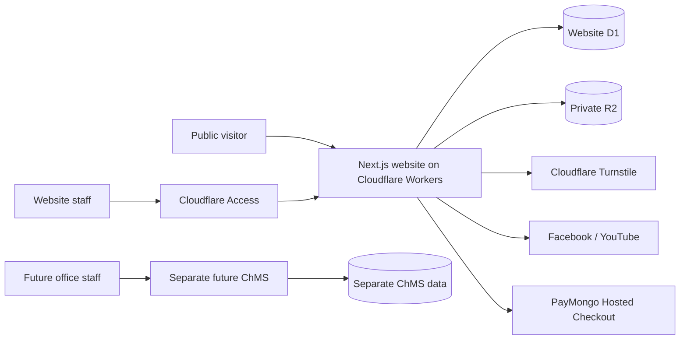

# Lifechangers Ministry Incorporated Website Architecture

## Status

Cloudflare-first architecture approved. The website/ChMS separation was
accepted on 2026-09-17 in
`docs/decisions/0002-separate-website-and-chms-boundaries.md`.

This repository is the public outreach website plus its protected content,
prayer, contact, and staff-operations dashboard. It is not the church's member
management or bookkeeping system.

## System Context



There is no shared database, secret set, storage bucket, or Access application
between the website and future ChMS. Any later exchange requires an approved,
authenticated API or controlled export/import contract.

## Technology

- Next.js App Router, React, strict TypeScript and Tailwind CSS
- Cloudflare Workers through OpenNext
- D1 for website relational data and R2 for approved private files
- Cloudflare Access for staff identity; D1 roles for application authorization
- Turnstile plus rate limits for public prayer submissions
- Vitest/Testing Library for unit and component tests; Playwright for E2E
- PayMongo Hosted Checkout for one-time giving, with secrets stored as Worker
  secrets and verified webhooks as the only trusted payment status

The initial target is Cloudflare's free tiers. The domain and payment-provider
transaction fees are expected external costs. Paid Cloudflare capacity should
be a configuration upgrade, not an application rewrite.

## Application Boundaries

```text
src/app                 Route and page composition
src/components          Reusable UI
src/features            Feature actions, schemas and view models
src/server/services     Authorization and business rules
src/server/repositories Parameterized D1 access
src/server/security     Verification, rate-limit and trusted-boundary helpers
migrations/d1           Ordered schema and policy migrations
```

Pages and components do not query D1 directly. Public inputs are validated on
the server. Protected actions require a verified Access identity, active staff
profile, and explicit permission.

## Public Website

Public routes expose only published sermons, ministries, announcements,
bulletins and schedule occurrences. Private locations are removed by the
repository/read layer. Published content uses targeted cache invalidation.
Private and administrative responses use `no-store` behavior.

R2 buckets are not publicly listed. File delivery validates the requested
object, publication state, permitted type, and safe response headers.

## Protected Dashboard and Roles

The six roles are System Administrator, Pastor, Core Leader, Content Publisher,
Content Editor and Prayer Warrior. Senior/Associate Pastor are job titles, not
different permission bundles. Detailed grants are in `PERMISSION_MATRIX.md`.

Core principles:

- individual accounts only; no shared keys or passwords;
- authorization is server-enforced for every protected operation;
- System Administrator manages security but has no prayer content access by
  default;
- Core Leader is a highly trusted, reasoned elevation with Pastor-equivalent
  website operations;
- Content Publisher may approve their own work as explicitly approved;
- Prayer Warrior access is restricted to assigned team requests; and
- the final System Administrator cannot be removed or suspended.

## Prayer Privacy

Public prayer submission supports `team` and `pastoral_only`. Turnstile is
bypassed only by an explicit local-development flag and must be configured for
the real hostname before production. Public responses are generic, requests are
rate-limited, and logs do not contain prayer text or contact data.

Pastor/Core Leader can handle both scopes. Prayer Warriors can view/update/
close only permitted assigned team requests and may escalate them. Contact data
is revealed only when consent and permission are both present, and the reveal
is audited.

Closed-request contact fields are redacted after 30 days and prayer text after
90 days. Legal hold prevents deletion. A daily Worker cron executes bounded
retention batches.

## Giving Boundary

The website offers a simple `Give Tithes & Offerings` visitor action using
PayMongo Hosted Checkout. The approved public labels are **Tithes & Offerings**,
**Church Building Fund** and **Love Gift**. Love Gift is a general,
church-managed fund at launch: the form does not accept or select a recipient.
Questions concerning a specific person go through the church contact path.

The interface explains that an amount starts at zero, but PayMongo cannot
process a zero-value payment. Server validation therefore accepts ₱1.00 through
₱100,000.00 per checkout. Card, GCash and QR Ph are requested from PayMongo;
the final availability remains subject to the church account. PayMongo's
`pass_on_fees` setting shows method-specific fees before the giver confirms.

The website will not maintain offline gifts, donor ledgers, bookkeeping,
adjustments, refunds, official receipts or finance reports. PayMongo's dashboard
is the website finance source of truth. Refunds and reconciliation remain
provider/office processes until the separate ChMS is designed.

## Deployment and Secrets

- Local, preview and production have separate D1 databases, R2 buckets,
  bindings and Access configuration.
- Secrets use `.dev.vars` locally and Cloudflare Worker secrets remotely; they
  are never committed or returned to clients.
- Production deployment waits for a church-owned domain/account, real Access
  policy, Turnstile hostnames, tested backup/restore and leadership approval.
- Observability logs identifiers and error codes, not prayer text, contact
  details, tokens, payer details or payment payloads.

## Legacy Supabase Prototype

Supabase helpers/migrations remain inactive as a rollback prototype. Removing
them is a separate, explicitly approved cleanup after Cloudflare cutover checks.
They are not the production backend.
